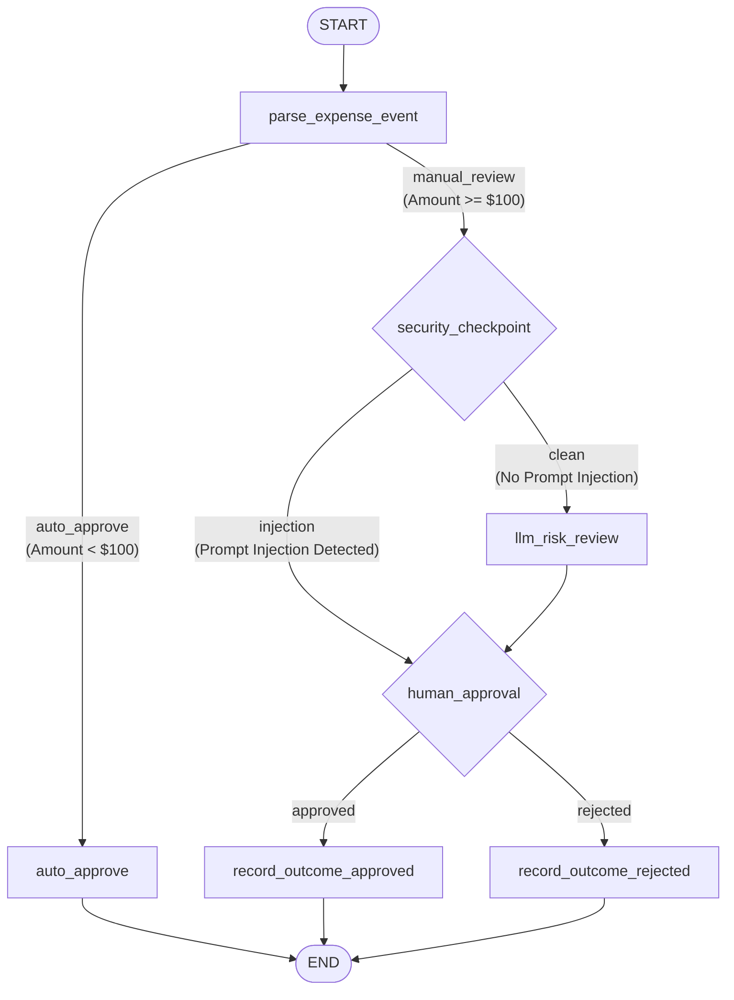

# ADK Expense Agent: Workflow Analysis & Architecture Design

This document details the analysis of the current `expense_agent` workflow in the **ambient-expense-agent** project. It outlines the node-by-node execution flow, state management, and highlights architectural design questions that must be resolved before implementing the FastAPI Pub/Sub subscriber integration.

---

## 1. Overview of the Flowchart & ADK 2.0 Graph Workflow

The `expense_agent` is designed as an automated expense approval router. It processes incoming expense details and either auto-approves them or conducts a dual security + LLM risk assessment before routing to a Human-in-the-Loop (HITL) step.

### High-Level Workflow Layout

---

## 2. Node-by-Node Analysis

### 2.1. `parse_expense_event` (Async Node)
* **Input Type**: `Any` (handles dict, JSON string, or Google GenAI/ADK `Content` structure).
* **Processing**:
  * Extracts standard fields (`amount`, `submitter`, `category`, `description`, `date`) via a utility helper `parse_payload()`.
  * **Built-in Pub/Sub Support**: Notably, `parse_payload()` already includes base64-decoding checks (`base64.b64decode(data_val)`) specifically designed to read base64-encoded messages wrapped inside a Pub/Sub `{"data": "..."}` schema.
* **Routing Decision**:
  * **`auto_approve`**: If `amount < THRESHOLD_AMOUNT` (default: `$100.0` from `Settings`).
  * **`manual_review`**: If `amount >= THRESHOLD_AMOUNT`.
* **State Updates**: Saves the extracted expense structure under `state["expense"]`.

### 2.2. `auto_approve` (Sync Node)
* **Input Type**: `dict` (parsed expense details).
* **Processing**:
  * Logs the approved outcome to `expenses.log` using the custom `log_outcome()` helper.
* **Output**: Returns a dictionary: `{"status": "approved", "reason": "auto_approved", "details": node_input}`.
* **Routing**: Leads directly to the end of the workflow.

### 2.3. `security_checkpoint` (Sync Node)
* **Input Type**: `dict` (parsed expense details).
* **Processing**:
  * **PII Redaction**: Scrubs SSNs (`\b\d{3}-\d{2}-\d{4}\b`) and 16-digit credit card patterns (`\b(?:\d{4}[\s\-]?){3}\d{4}\b`), replacing them with `[REDACTED-SSN]` and `[REDACTED-CC]`.
  * **Prompt Injection Detection**: Runs the expense description against a compiled regular expression (`_RE_INJECTION`) to block common jailbreak/override patterns (e.g., `"ignore previous instructions"`, `"bypass rules"`).
* **Routing Decision**:
  * **`injection`**: If prompt injection is detected. It **bypasses the LLM completely** to prevent prompt injection exploitation. Instead, it synthesizes a dummy `RiskReview` object (Risk Score 5/5, warning reasoning) and routes directly to the human reviewer.
  * **`clean`**: If no injection is found, passes the redacted description to `llm_risk_review`.
* **State Updates**: Stores `state["redacted_pii"]` and flags `state["security_event"]` if injection was caught.

### 2.4. `llm_risk_review` (Async Node)
* **Input Type**: `dict` (scrubbed expense details).
* **Processing**:
  * Prompts Gemini (configured to `gemini-2.5-flash` by default) to analyze the expense details for policy violations.
  * Uses the **Structured Outputs** feature (`response_schema=RiskReview`) to guarantee a structured JSON payload:
    * `risk_score` (int, 1-5 scale)
    * `risk_factors` (list of strings)
    * `alert_raised` (bool)
    * `reasoning` (str)
* **Output**: Event output containing both `{ "expense": ..., "risk_review": ... }`.
* **State Updates**: Saves the review under `state["risk_review"]`.

### 2.5. `human_approval` (Async Node, `rerun_on_resume=True`)
* **Input Type**: `dict` (containing the expense and the risk review details).
* **Processing**:
  * Checks if `ctx.resume_inputs` contains `"approve_expense"`.
  * If **not present**: Interrupts execution and yields a `RequestInput(interrupt_id="approve_expense", message=...)`.
  * If **present**: Checks if the answer is `"yes"`, `"y"`, or `"approve"`.
* **Routing Decision**:
  * **`approved`** if approved by the human.
  * **`rejected`** if denied.
* **Output**: Sends `{ "approved": bool, "details": ..., "risk": ... }` to the outcome recorders.

### 2.6. `record_outcome_approved` & `record_outcome_rejected` (Sync Nodes)
* **Input Type**: `dict` (approval decision structure).
* **Processing**:
  * Appends the final decision and reasoning to `expenses.log` via the `log_outcome()` helper.
* **Output**: Returns a text confirmation string.

---

## 3. Telemetry and Logging Configuration

* **OpenTelemetry & GenAI Instrumentation**: Managed in `expense_agent/app_utils/telemetry.py`.
* **GCS Logging**: If `LOGS_BUCKET_NAME` is configured, it sends telemetry logs directly to Google Cloud Storage.
* **Prompt Logging Policy**: Set to `NO_CONTENT` by default to avoid uploading sensitive prompt data (helps with data governance and privacy policies).

---

## 4. Architectural Questions & Strategic Clarifications

To transform this system into a fully production-grade **ambient agent** subscribing to GCP Pub/Sub events via FastAPI, we must define the integration model. Please review and clarify the following questions:

### ❓ Question 1: How should the Human-in-the-Loop (HITL) step interact in an ambient context?
The workflow relies on `human_approval` which interrupts execution. 
* **Current state**: The playground environment expects the user to interactively type `yes`/`no` into the chat terminal.
* **Pub/Sub (Ambient) context**: Pub/Sub triggers are asynchronous and fire-and-forget. When a webhook receives a Pub/Sub message, it cannot block and wait for human input indefinitely.
* **Proposed Solution**: 
  1. The agent receives an expense via Pub/Sub, processes it, and if it reaches the `human_approval` node, it interrupts.
  2. The webhook handler saves the session ID and details, and triggers an out-of-band notification (e.g., Slack message with buttons, or an email).
  3. A separate endpoint in the FastAPI app (e.g., `/approve-callback`) is triggered when the human clicks the button, which resumes the ADK session using the session ID.
* *Do you have a preferred channel for these notifications (e.g., Slack, Email, Custom Dashboard UI), or is there another pattern you would like to follow?*

### ❓ Question 2: How will session state be persisted?
* **Current state**: Session storage is currently set to in-memory (`session_service_uri = None`), which means if the FastAPI app restarts, all interrupted workflow sessions (waiting for human approval) are lost.
* **Pub/Sub (Ambient) context**: In a production ambient scenario, the application is stateless and could scale horizontally or restart.
* *Do you want to configure a persistent storage backend (such as Firestore or Google Cloud Storage) for session tracking using ADK's native persistent storage providers?*

### ❓ Question 3: What is the policy for processing duplicate/retry Pub/Sub messages?
Pub/Sub guarantees **at least once** delivery. This means the same expense event could potentially be delivered more than once.
* *Do we need to implement idempotency checks (e.g., checking if the expense ID/date/submitter combination has already been processed or logged in `expenses.log`) to avoid duplicate approvals or multiple notifications for the same expense?*

### ❓ Question 4: Where should final outcomes be written in production?
* **Current state**: Outcomes are written to a local text file `expenses.log`.
* *For the ambient cloud deployment, do you want to persist these outcomes to a structured cloud database (e.g., Cloud SQL, Firestore, BigQuery) or continue appending to a log file/bucket?*
